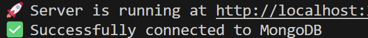

# MongoNetwork

## Video

https://youtu.be/K8eJKcVV3UI

## Description

MongoNetwork is a NoSQL-based social network API that allows users to share thoughts, react to friends' thoughts, and manage friend lists. Built with MongoDB, Mongoose, and Express.js, this API provides a backend service for social applications where users can connect, share, and engage with each other.

## Table of Contents (Optional)

If your README is long, add a table of contents to make it easy for users to find what they need.

- [Video](#video)
- [Description](#description)
- [Installation](#installation)
- [Usage](#usage)
- [Credits](#credits)
- [License](#license)
- [Badges](#badges)
- [Features](#features)
- [Contribute](#how-to-contribute)
- [Tests](#tests)

## Installation

1. git clone
2. cd MongoNetwork
3. npm i
4. Set up .env file
5. node seeds/seed.js
6. node server.js

## Usage

## Credits

No Collaborators

## License

No License

## Badges

JavaScript, MongoDB

## Features

NoSQL database structure using MongoDB

Fully RESTful API with Express.js

Users can add thoughts, react, and manage friends

Supports CRUD operations on users and thoughts

## How to Contribute

Fork & Clone Repo and make your own branch and push code to make a PR.

## Tests

Make a tests folder and do the command npm run tests.
